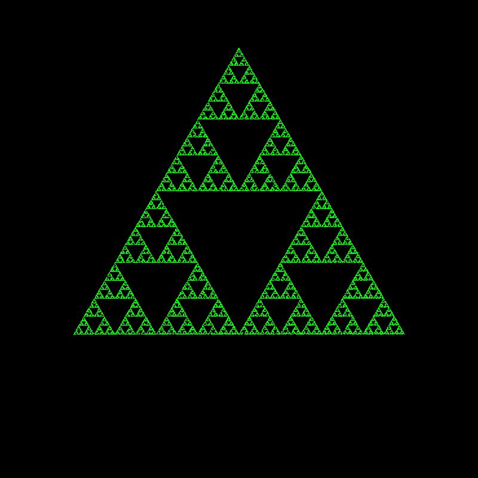

# Chaos Game


To run Chaos Game, type:

```commandline
python main.py 3
```
Generates this image:



You can substitute the `3` with a different integer >= 3 for different fractals. Look in examples folder for other fractals.